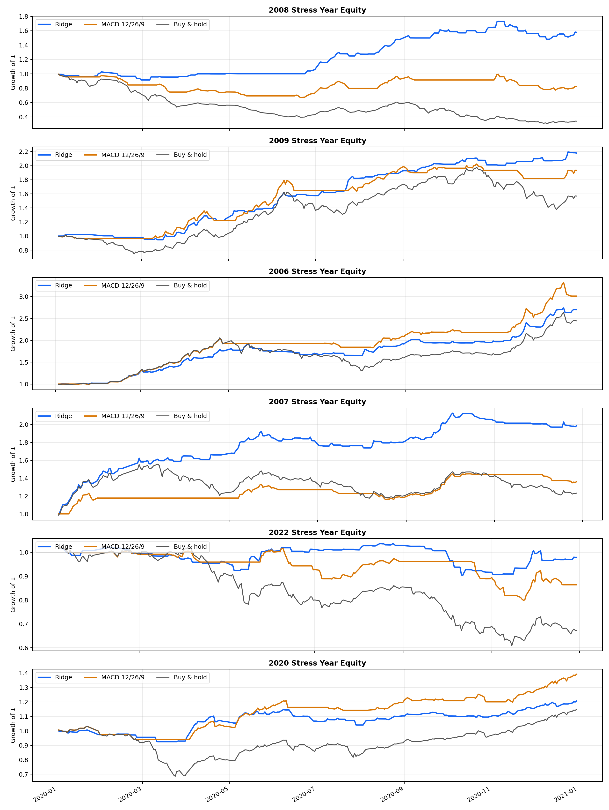
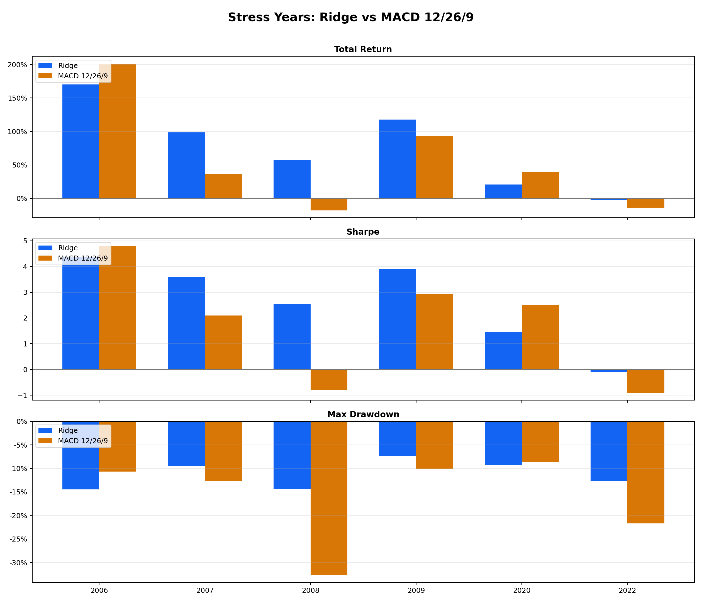
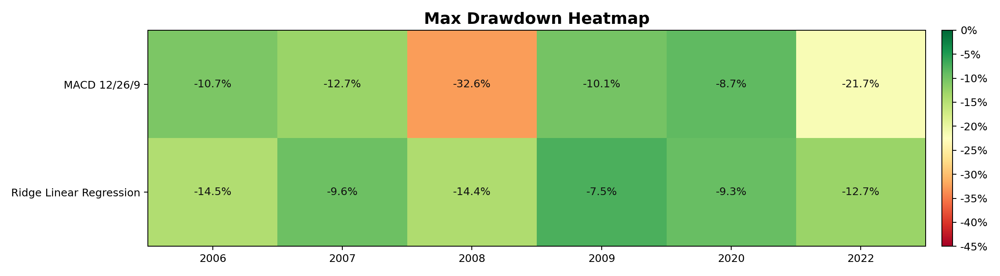

# Stress Test Ridge Linear Regression vs MACD 12/26/9

## Phương pháp

- Dữ liệu: `data.csv`, đã parse lại OHLCV để xử lý dấu phẩy hàng nghìn.
- Chọn 6 năm biến động nhất theo annualized volatility của lợi suất ngày VN-Index.
- Ridge Linear Regression: mỗi năm stress được train lại bằng toàn bộ dữ liệu trước ngày 01/01 của năm đó, sau đó dự báo từng phiên trong năm. Cách này tránh dùng dữ liệu tương lai.
- MACD 12/26/9: long khi MACD line > signal line, exit về cash khi MACD line <= signal line. Tín hiệu tại close được áp dụng cho lợi suất phiên kế tiếp.
- Phí giao dịch: 5.0 bps mỗi lần thay đổi vị thế.

## Các năm biến động nhất

| year | rows | start      | end        | annualized_volatility | buy_hold_return | buy_hold_max_drawdown | worst_daily_return | best_daily_return |
| ---- | ---- | ---------- | ---------- | --------------------- | --------------- | --------------------- | ------------------ | ----------------- |
| 2008 | 245  | 2008-01-02 | 2008-12-31 | 36.97%                | -65.96%         | -68.85%               | -4.69%             | 4.75%             |
| 2009 | 251  | 2009-01-02 | 2009-12-31 | 34.51%                | 56.78%          | -30.32%               | -4.55%             | 4.76%             |
| 2006 | 249  | 2006-01-03 | 2006-12-29 | 32.20%                | 144.48%         | -36.81%               | -4.84%             | 4.78%             |
| 2007 | 248  | 2007-01-02 | 2007-12-28 | 27.24%                | 23.31%          | -24.50%               | -4.37%             | 4.23%             |
| 2022 | 249  | 2022-01-04 | 2022-12-30 | 24.78%                | -32.78%         | -40.34%               | -4.95%             | 4.81%             |
| 2020 | 252  | 2020-01-02 | 2020-12-31 | 22.75%                | 14.87%          | -33.51%               | -6.28%             | 4.98%             |

## Bảng so sánh kết quả stress test

| year | strategy                | total_return | cagr    | annual_volatility | sharpe | sortino | max_drawdown | calmar | profit_factor | win_rate_active_days | exposure | number_of_trades | annual_alpha_vs_buy_hold |
| ---- | ----------------------- | ------------ | ------- | ----------------- | ------ | ------- | ------------ | ------ | ------------- | -------------------- | -------- | ---------------- | ------------------------ |
| 2006 | MACD 12/26/9            | 201.15%      | 205.18% | 23.95%            | 4.788  | 5.876   | -10.67%      | 19.224 | 2.826         | 63.76%               | 58.23%   | 10.000           | 60.67%                   |
| 2006 | Ridge Linear Regression | 170.07%      | 173.33% | 23.64%            | 4.380  | 6.749   | -14.47%      | 11.981 | 2.606         | 47.00%               | 57.83%   | 112.000          | 51.26%                   |
| 2006 | Ridge minus MACD        | -31.07%      | -31.85% | -0.31%            | -0.409 | 0.873   | -3.79%       | -7.243 | -0.220        | -16.76%              | -0.40%   | 102.000          | -9.41%                   |
| 2007 | MACD 12/26/9            | 35.99%       | 36.60%  | 15.45%            | 2.100  | 2.605   | -12.66%      | 2.892  | 1.762         | 56.00%               | 38.31%   | 11.000           | 24.33%                   |
| 2007 | Ridge Linear Regression | 98.68%       | 100.67% | 20.00%            | 3.592  | 5.894   | -9.56%       | 10.534 | 2.276         | 42.37%               | 52.02%   | 97.000           | 57.74%                   |
| 2007 | Ridge minus MACD        | 62.69%       | 64.07%  | 4.55%             | 1.493  | 3.289   | 3.10%        | 7.643  | 0.513         | -13.63%              | 13.71%   | 86.000           | 33.40%                   |
| 2008 | MACD 12/26/9            | -17.78%      | -17.83% | 22.40%            | -0.786 | -0.898  | -32.62%      | -0.547 | 0.842         | 46.40%               | 48.16%   | 16.000           | 20.25%                   |
| 2008 | Ridge Linear Regression | 57.78%       | 58.02%  | 19.09%            | 2.554  | 3.055   | -14.39%      | 4.031  | 1.915         | 44.03%               | 36.73%   | 89.000           | 79.01%                   |
| 2008 | Ridge minus MACD        | 75.56%       | 75.86%  | -3.31%            | 3.340  | 3.953   | 18.23%       | 4.578  | 1.073         | -2.37%               | -11.43%  | 73.000           | 58.77%                   |
| 2009 | MACD 12/26/9            | 93.26%       | 93.76%  | 23.59%            | 2.925  | 4.029   | -10.13%      | 9.258  | 1.911         | 55.07%               | 52.19%   | 14.000           | 44.77%                   |
| 2009 | Ridge Linear Regression | 117.82%      | 118.50% | 20.52%            | 3.917  | 6.063   | -7.45%       | 15.903 | 2.939         | 43.54%               | 37.05%   | 109.000          | 61.69%                   |
| 2009 | Ridge minus MACD        | 24.57%       | 24.73%  | -3.07%            | 0.992  | 2.034   | 2.68%        | 6.645  | 1.028         | -11.54%              | -15.14%  | 95.000           | 16.92%                   |
| 2020 | MACD 12/26/9            | 39.14%       | 39.14%  | 13.63%            | 2.493  | 2.383   | -8.68%       | 4.508  | 1.750         | 62.58%               | 61.90%   | 14.000           | 27.96%                   |
| 2020 | Ridge Linear Regression | 20.67%       | 20.67%  | 13.49%            | 1.461  | 1.605   | -9.28%       | 2.228  | 1.431         | 43.55%               | 51.98%   | 111.000          | 13.88%                   |
| 2020 | Ridge minus MACD        | -18.47%      | -18.47% | -0.14%            | -1.032 | -0.778  | -0.59%       | -2.280 | -0.319        | -19.03%              | -9.92%   | 97.000           | -14.07%                  |
| 2022 | MACD 12/26/9            | -13.62%      | -13.78% | 15.15%            | -0.902 | -0.839  | -21.68%      | -0.635 | 0.795         | 44.93%               | 51.81%   | 17.000           | 0.15%                    |
| 2022 | Ridge Linear Regression | -2.11%       | -2.14%  | 12.97%            | -0.101 | -0.107  | -12.71%      | -0.168 | 0.970         | 29.87%               | 37.35%   | 122.000          | 8.93%                    |
| 2022 | Ridge minus MACD        | 11.51%       | 11.64%  | -2.17%            | 0.801  | 0.732   | 8.96%        | 0.468  | 0.175         | -15.06%              | -14.46%  | 105.000          | 8.78%                    |

## Nhận xét chi tiết

- Ridge có total return cao hơn MACD trong 4/6 năm stress, Sharpe cao hơn trong 4/6 năm, và max drawdown nhỏ hơn trong 4/6 năm.
- Năm Ridge có Sharpe tốt nhất là 2006 với Sharpe 4.38, CAGR 173.33%, max drawdown -14.47%.
- Năm Ridge chịu drawdown sâu nhất là 2006, max drawdown -14.47%. Đây là năm cần quan sát kỹ nếu muốn thêm bộ lọc risk-off.
- Năm MACD có Sharpe tốt nhất là 2006 với Sharpe 4.79, CAGR 205.18%, max drawdown -10.67%.
- Năm MACD chịu drawdown sâu nhất là 2008, max drawdown -32.62%. MACD thường chậm hơn khi thị trường đảo chiều nhanh, nên dễ bị kéo drawdown trong các pha whipsaw.
- Ridge phản ứng linh hoạt hơn vì dùng nhiều feature về momentum, volatility, range và volume. Đổi lại, số lần giao dịch thường cao hơn MACD, nên kết quả nhạy cảm hơn với phí và slippage.
- MACD 12/26/9 đơn giản, dễ giải thích và ít turnover hơn. Nếu mục tiêu là hệ thống dễ triển khai thủ công, MACD vẫn có giá trị tham chiếu tốt; nếu mục tiêu là risk-adjusted return trong năm biến động, Ridge đang có lợi thế hơn.
- Khuyến nghị: dùng Ridge như lớp tín hiệu chính, nhưng thêm điều kiện phòng vệ như giới hạn drawdown theo tháng/quý, volatility filter, hoặc yêu cầu MACD không quá xấu để giảm số trade trong giai đoạn nhiễu mạnh.

## Hình ảnh

## File đầu ra

- `outputs_stress_volatile_years/stress_years_selected.csv`
- `outputs_stress_volatile_years/stress_years_strategy_metrics.csv`
- `outputs_stress_volatile_years/stress_years_strategy_metrics_with_advantage.csv`
- `outputs_stress_volatile_years/stress_years_daily_backtests.csv`