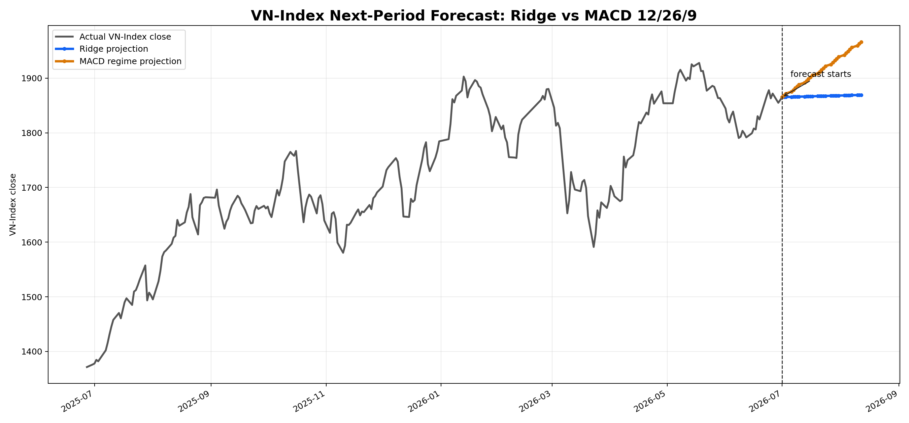
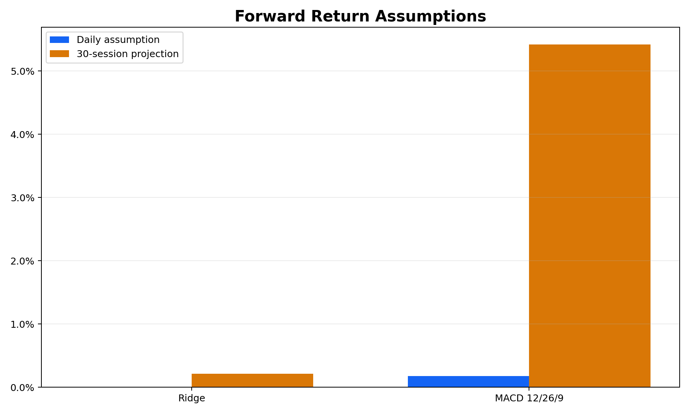
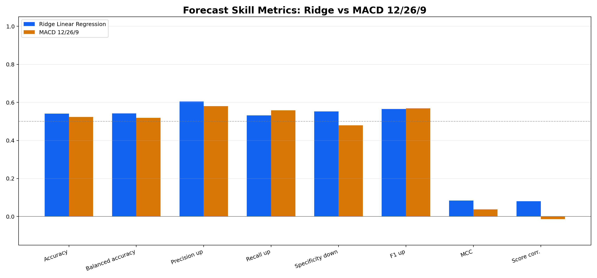
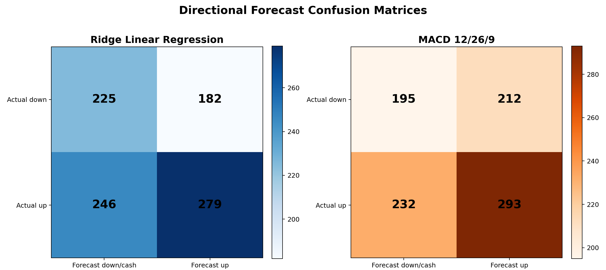
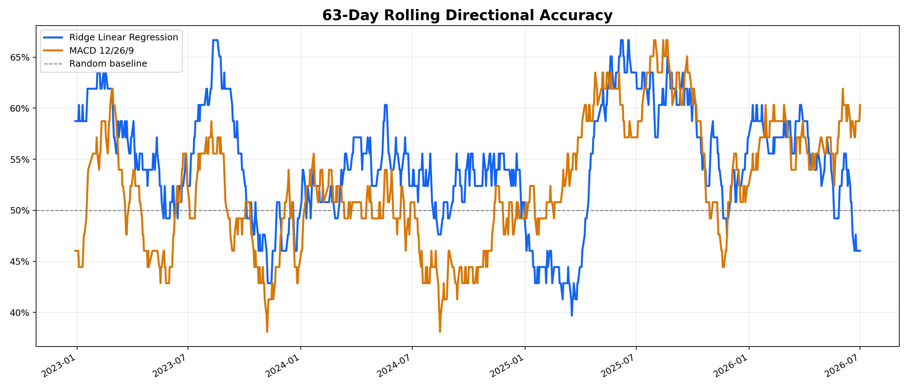
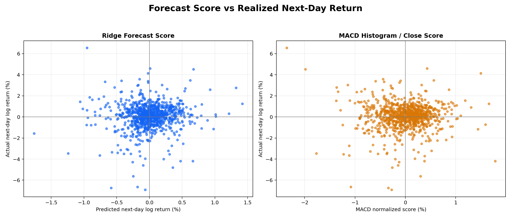
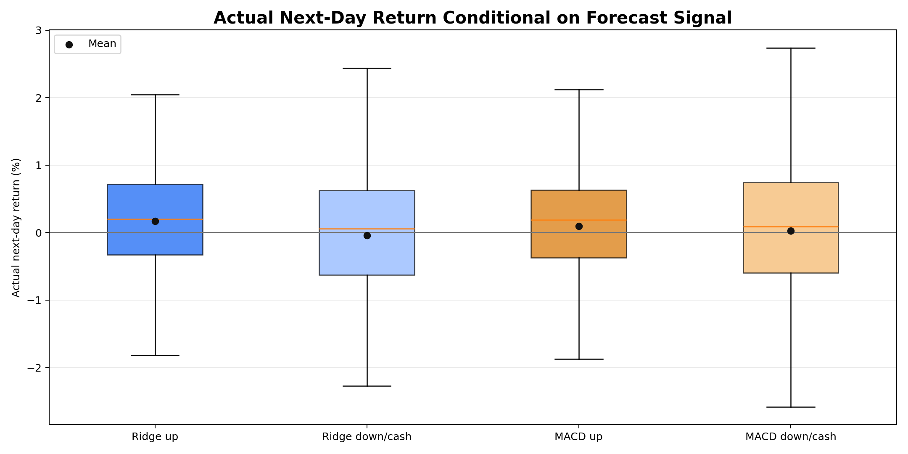

# Linear Regression vs MACD in VN-Index Context

This repository compares linear-regression forecasting models against the MACD 12/26/9 trading rule on VN-Index data.

## Contents

- `linear_regression_backtest.py`: builds features, trains linear models, runs the Ridge strategy backtest, and exports visual reports.
- `compare_ridge_vs_macd12269.py`: compares the best Ridge model against MACD 12/26/9 on the same test period.
- `forecast_skill_comparison.py`: compares the next-day directional forecasting skill of Ridge and MACD, then exports README-ready charts.
- `forward_forecast_next_period.py`: trains the latest Ridge model and projects the next VN-Index period against the current MACD regime.
- `stress_test_volatile_years.py`: retrains Ridge year by year and stress tests the most volatile VN-Index years against MACD.
- `READ.md`: detailed Vietnamese stress-test report with tables, charts, and interpretation.
- `data.csv`: VN-Index OHLCV input data.

## Main Reports

- Linear-regression report: `outputs_linear_regression_backtest/report.html`
- Ridge vs MACD report: `outputs_model_vs_macd12269/ridge_vs_macd12269_report.html`
- Forecast-skill charts and tables: `outputs_forecast_skill_comparison/`
- Next-period VN-Index forecast: `outputs_forward_forecast/`
- Stress-test report: `READ.md`

## Next-Period VN-Index Forecast

The latest available row in `data.csv` is `2026-07-01`, with VN-Index close at `1,865.37`. The projection below starts from the next business session and extends `30` business sessions.

Important method note:

- Ridge gives a numeric one-step next-day return forecast. The forward path compounds the latest one-step forecast because future OHLCV features are unknown.
- MACD 12/26/9 is a directional regime model, not a direct price model. Its forward path compounds the historical average next-day return observed under the current MACD regime.
- Current MACD regime is `up`, so the MACD path is steeper than the Ridge path.

| Model | Daily Return Assumption | 30-Session Forecast Close | 30-Session Forecast Return | Direction / Regime |
|---|---:|---:|---:|---|
| Ridge Linear Regression | 0.007% | 1,869.36 | 0.21% | up, very mild |
| MACD 12/26/9 | 0.176% | 1,966.51 | 5.42% | up regime |

### Forecast Lines



### Return Assumptions



## Forecasting Skill Comparison

This section focuses on forecast quality, not only trading PnL. The comparison window is `2022-10-04` to `2026-07-01`.

- Ridge forecast rule: predicted next-day log return `> 0` means forecast up.
- MACD 12/26/9 forecast rule: MACD line `> signal line` means forecast up; otherwise down/cash.
- Interpretation: Ridge is better at filtering down/cash days and has a stronger return-score correlation. MACD has slightly higher recall on up days, but lower specificity and weaker score correlation.

| Model | Accuracy | Balanced Accuracy | Precision Up | Recall Up | Specificity Down | F1 Up | MCC | Score Corr. | Forecast Up Freq. | Return Spread |
|---|---:|---:|---:|---:|---:|---:|---:|---:|---:|---:|
| Ridge Linear Regression | 54.08% | 54.21% | 60.52% | 53.14% | 55.28% | 56.59% | 0.0836 | 0.0808 | 49.46% | 0.21% |
| MACD 12/26/9 | 52.36% | 51.86% | 58.02% | 55.81% | 47.91% | 56.89% | 0.0370 | -0.0133 | 54.18% | 0.07% |
| Ridge minus MACD | 1.72% | 2.35% | 2.50% | -2.67% | 7.37% | -0.30% | 0.0465 | 0.0941 | -4.72% | 0.14% |

### Forecast Skill Metrics



### Directional Confusion Matrices



### Rolling Directional Accuracy



### Forecast Score vs Realized Return



### Conditional Next-Day Return



## Reproduce

Use the `eda` conda environment:

```bash
/home/namngyh/miniconda3/envs/eda/bin/python linear_regression_backtest.py
/home/namngyh/miniconda3/envs/eda/bin/python compare_ridge_vs_macd12269.py
/home/namngyh/miniconda3/envs/eda/bin/python forecast_skill_comparison.py
/home/namngyh/miniconda3/envs/eda/bin/python forward_forecast_next_period.py
/home/namngyh/miniconda3/envs/eda/bin/python stress_test_volatile_years.py
```

The CSV parser reconstructs OHLCV values that are split by thousands separators in the source file.
